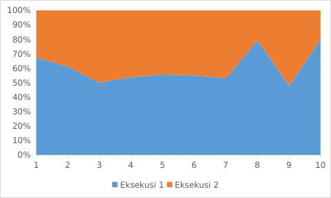
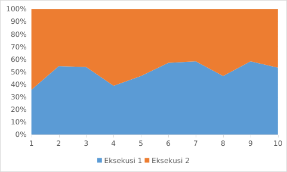

# About

Pada penelitian ini akan melakukan uji coba eksekusi sintaks SQL untuk mencari sintaks yang lebih optimal bedasarkan waktu eksekusi, lebih kecil waktu eksekusi maka lebih optimal.

# Keterangan database yang digunakan

```SQL
 SHOW TABLES;
```

|   | Tables_in_kode_desa |
| - | ------------------- |
| 0 | desa                |
| 1 | kab                 |
| 2 | kec                 |
| 3 | prov                |

## Tabel prov

```SQL
DESCRIBE prov;
```

|   | Field   | Type        | Null | Key | Default | Extra |
| - | ------- | ----------- | ---- | --- | ------- | ----- |
| 0 | id_prov | varchar(13) | NO   | PRI | None    |       |
| 1 | nm_prov | text        | YES  |     | None    |       |

|   | COUNT(*) |
| - | -------- |
| 0 | 35       |

## Tabel kab

```SQl
DESCRIBE kab;
```

|   | Field   | Type        | Null | Key | Default | Extra |
| - | ------- | ----------- | ---- | --- | ------- | ----- |
| 0 | id_prov | varchar(13) | NO   | MUL | None    |       |
| 1 | id_kab  | varchar(13) | NO   | PRI | None    |       |
| 2 | nm_kab  | text        | YES  |     | None    |       |

|   | COUNT(*) |
| - | -------- |
| 0 | 515      |

## Tabel kec

```SQl
DESCRIBE kec;
```

|   | Field   | Type        | Null | Key | Default | Extra |
| - | ------- | ----------- | ---- | --- | ------- | ----- |
| 0 | id_prov | varchar(13) | NO   | MUL | None    |       |
| 1 | id_kab  | varchar(13) | NO   | MUL | None    |       |
| 2 | id_kec  | varchar(13) | NO   | PRI | None    |       |
| 3 | nm_kec  | text        | YES  |     | None    |       |

|   | COUNT(*) |
| - | -------- |
| 0 | 7203     |

## Tabel desa

```SQl
DESCRIBE desa;
```

|   | Field   | Type        | Null | Key | Default | Extra |
| - | ------- | ----------- | ---- | --- | ------- | ----- |
| 0 | id_desa | varchar(15) | NO   | PRI | None    |       |
| 1 | id_prov | varchar(13) | NO   | MUL | None    |       |
| 2 | id_kab  | varchar(13) | NO   | MUL | None    |       |
| 3 | id_kec  | varchar(13) | NO   | MUL | None    |       |
| 4 | nm_desa | text        | YES  |     | None    |       |
| 5 | st_desa | text        | YES  |     | None    |       |

COUNT 83437

|   | COUNT(*) |
| - | -------- |
| 0 | 83437    |

# Kondisi sistem yang digunakan

System:

    Kernel: 5.15.0-76-generic x86_64 bits: 64 compiler: gcc v: 11.3.0 Desktop: Xfce 4.18.1
    
    tk: Gtk 3.24.33 wm: xfwm dm: LightDM Distro: Linux Mint 21.2 Victoria base: Ubuntu 22.04 jammy


Machine:

    Type: Laptop System: LENOVO product: 81ST v: Lenovo IdeaPad S145-14AST
    
    serial: <superuser required> Chassis: type: 10 v: Lenovo IdeaPad S145-14AST
    
    serial: <superuser required>
    
    Mobo: LENOVO model: LNVNB161216 v: SDK0Q55754WIN serial: <superuser required> UEFI: LENOVO
    
    v: AYCN21WW date: 03/05/2020

Battery:

    ID-1: BAT0 charge: 13.6 Wh (54.8%) condition: 24.8/30.6 Wh (81.1%) volts: 7.5 min: 7.6
    
    model: CPT-COS L16C2PB2 serial: <filter> status: Discharging

CPU:

    Info: dual core model: AMD A4-9125 RADEON R3 4 COMPUTE CORES 2C+2G bits: 64 type: MCP
    
    arch: Excavator rev: 0 cache: L1: 192 KiB L2: 2 MiB
    
    Speed (MHz): avg: 2096 min/max: 1300/2300 boost: enabled cores: 1: 2096 2: 2096 bogomips: 9182
    
    Flags: avx avx2 ht lm nx pae sse sse2 sse3 sse4_1 sse4_2 sse4a ssse3 svm

Graphics:

    Device-1: AMD Stoney [Radeon R2/R3/R4/R5 Graphics] vendor: Lenovo driver: amdgpu v: kernel
    
    ports: active: eDP-1 empty: HDMI-A-1 bus-ID: 00:01.0 chip-ID: 1002:98e4

    Device-2: IMC Networks Integrated Camera type: USB driver: uvcvideo bus-ID: 1-1.3:4
    
    chip-ID: 13d3:5a08
    
    Display: x11 server: X.Org v: 1.21.1.4 compositor: xfwm v: 4.18.0 driver: X:
    
    loaded: amdgpu,ati unloaded: fbdev,modesetting,vesa gpu: amdgpu display-ID: :0.0 screens: 1
    
    Screen-1: 0 s-res: 1366x768 s-dpi: 96
    
    Monitor-1: eDP res: 1366x768 dpi: 112 diag: 354mm (13.9")
  
    OpenGL: renderer: STONEY (stoney LLVM 15.0.7 DRM 3.42 5.15.0-76-generic)
    v: 4.5 Mesa 23.0.4-0ubuntu1~22.04.1 direct render: Yes
Audio:

    Device-1: AMD vendor: Lenovo driver: snd_hda_intel v: kernel bus-ID: 00:01.1 chip-ID: 1002:15b3
    
    Device-2: AMD Family 15h Audio vendor: Lenovo driver: snd_hda_intel v: kernel bus-ID: 00:09.2
    chip-ID: 1022:157a

    Sound Server-1: ALSA v: k5.15.0-76-generic running: yes
    Sound Server-2: PulseAudio v: 15.99.1 running: yes
    
    Sound Server-3: PipeWire v: 0.3.48 running: yes

Network:

    Device-1: Qualcomm Atheros QCA9377 802.11ac Wireless Network Adapter vendor: Lenovo
    
    driver: ath10k_pci v: kernel pcie: speed: 2.5 GT/s lanes: 1 bus-ID: 02:00.0 chip-ID: 168c:0042

    IF: wlp2s0 state: up mac: <filter>

Bluetooth:

    Device-1: Qualcomm Atheros type: USB driver: btusb v: 0.8 bus-ID: 1-1.2:3 chip-ID: 0cf3:e500
    
    Report: hciconfig ID: hci0 rfk-id: 2 state: down bt-service: enabled,running rfk-block:
    
    hardware: no software: yes address: <filter>

Drives:
    
    Local Storage: total: 238.47 GiB used: 33.81 GiB (14.2%)
    ID-1: /dev/sda model: JOINT SATA 2.5 SSD H500 256GB size: 238.47 GiB speed: 6.0 Gb/s
    
    serial: <filter>

Partition:
  
    ID-1: / size: 156.53 GiB used: 33.77 GiB (21.6%) fs: ext4 dev: /dev/sda4
  
    ID-2: /boot/efi size: 252 MiB used: 40.6 MiB (16.1%) fs: vfat dev: /dev/sda1

Swap:

    ID-1: swap-1 type: file size: 2 GiB used: 59.5 MiB (2.9%) priority: -2 file: /swapfile

USB:

    Hub-1: 1-0:1 info: Full speed or root hub ports: 2 rev: 2.0 speed: 480 Mb/s chip-ID: 1d6b:0002
    
    Hub-2: 1-1:2 info: Advanced Micro Devices Root Hub ports: 4 rev: 2.0 speed: 480 Mb/s
    
    chip-ID: 0438:7900
    
    Device-1: 1-1.2:3 info: Qualcomm Atheros type: Bluetooth driver: btusb rev: 2.0 speed: 12 Mb/s
    
    chip-ID: 0cf3:e500
    
    Device-2: 1-1.3:4 info: IMC Networks Integrated Camera type: Video driver: uvcvideo rev: 2.0
    
    speed: 480 Mb/s chip-ID: 13d3:5a08
    
    Device-3: 1-1.4:5 info: China Resource Semico Keyboard type: Keyboard,HID
    
    driver: hid-generic,usbhid rev: 1.1 speed: 1.5 Mb/s chip-ID: 1a2c:2124
    Hub-3: 2-0:1 info: Hi-speed hub with single TT ports: 4 rev: 2.0 speed: 480 Mb/s
    
    chip-ID: 1d6b:0002
  
    Device-1: 2-1:2 info: SHARKOON GmbH [Mediatrack Edge Mini Keyboard] type: Keyboard,Mouse
    
    driver: hid-generic,usbhid rev: 1.1 speed: 12 Mb/s chip-ID: 1ea7:0066
    
    Hub-4: 3-0:1 info: Super-speed hub ports: 4 rev: 3.0 speed: 5 Gb/s chip-ID: 1d6b:0003

Sensors:

    System Temperatures: cpu: 56.4 C mobo: N/A gpu: amdgpu temp: 56.0 C
    
    Fan Speeds (RPM): N/A

Repos:
    Packages: apt: 2416
    
    No active apt repos in: /etc/apt/sources.list
    
    Active apt repos in: /etc/apt/sources.list.d/microsoft-edge.list
        1: deb [arch=amd64] https: //packages.microsoft.com/repos/edge/ stable main
    
    Active apt repos in: /etc/apt/sources.list.d/obsproject-obs-studio-jammy.list
        1: deb [signed-by=/etc/apt/keyrings/obsproject-obs-studio-jammy.gpg] https: //ppa.launchpadcontent.net/obsproject/obs-studio/ubuntu jammy main
    
    Active apt repos in: /etc/apt/sources.list.d/official-package-repositories.list
        1: deb http: //packages.linuxmint.com victoria main upstream import backport
        2: deb http: //archive.ubuntu.com/ubuntu jammy main restricted universe multiverse
        3: deb http: //archive.ubuntu.com/ubuntu jammy-updates main restricted universe multiverse
        4: deb http: //archive.ubuntu.com/ubuntu jammy-backports main restricted universe multiverse
        5: deb http: //security.ubuntu.com/ubuntu/ jammy-security main restricted universe multiverse
    
    Active apt repos in: /etc/apt/sources.list.d/vscode.list
        1: deb [arch=amd64,arm64,armhf] http: //packages.microsoft.com/repos/code stable main
Info:

    Processes: 253 Uptime: 1h 24m Memory: 3.22 GiB used: 2.21 GiB (68.6%) Init: systemd v: 249
    
    runlevel: 5 Compilers: gcc: 11.3.0 alt: 11/12 Client: Unknown python3.10 client inxi: 3.3.13


DBMS:

    database: Sqlite3

# Eksekusi

## SELECT

* Eksekusi 1

```SQL
SELECT * FROM kab;
```

* Eksekusi 2

```SQL
SELECT nm_kab FROM kab;
```

Result

| time          | Eksekusi 1      | Eksekusi 2     |
| ------------- | --------------- | --------------- |
| 1             | 0,029           | 0,014           |
| 2             | 0,022           | 0,014           |
| 3             | 0,012           | 0,012           |
| 4             | 0,014           | 0,012           |
| 5             | 0,020           | 0,016           |
| 6             | 0,011           | 0,009           |
| 7             | 0,017           | 0,015           |
| 8             | 0,027           | 0,007           |
| 9             | 0,011           | 0,012           |
| 10            | 0,024           | 0,006           |
| **sum** | **0,187** | **0,117** |



## WHERE

### Data Type Match

* Eksekusi 1

  ```SQL
  SELECT nm_kab FROM kab
  WHERE id_prov='32';
  ```
* Eksekusi 2

  ```SQL
  SELECT nm_kab FROM kab
  WHERE id_prov=32;
  ```

| time     | Eksekusi 1 | Eksekusi 2 |
| -------- | ----------- | ---------- |
| 1        | 0,005       | 0,009      |
| 2        | 0,006       | 0,005      |
| 3        | 0,007       | 0,006      |
| 4        | 0,007       | 0,011      |
| 5        | 0,007       | 0,008      |
| 6        | 0,008       | 0,006      |
| 7        | 0,007       | 0,005      |
| 8        | 0,007       | 0,008      |
| 9        | 0,007       | 0,005      |
| 10       | 0,008       | 0,007      |
| **sum** | **0,069**  | **0,07**  |



# ByteByteGo: Secret To Optimizing SQL Queries - Understand The SQL Execution Order

```SQL
SELECT
FROM
JOIN
ON
WHERE
GROUP BY
HAVING
ORDER BY
LIMIT
```

Kode di atas merupakan saran Susunan Eksekusi untuk mengoptimalkan waktu yang dibutuhkan

## WHERE | HAVING

# Kesimpulan Umum

Dari kombinasi ekseskusi yang dilakukan berpengaruh terhadap waktu yang di butuhkan, hal tersebut menandakan memory temporary sangant berpengaruh.
