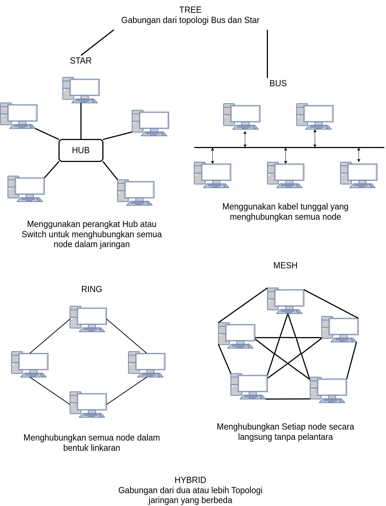

# Topologi Jaringan

 
 

# 1. Jenis transmisi komunikasi data adalah:
Jenis transmisi komunikasi data adalah cara atau metode yang digunakan untuk mengirimkan sinyal dari transmitter ke receiver dalam sistem komunikasi data. Jenis transmisi dapat dibedakan menjadi dua jenis utama, yaitu:

- **Transmisi serial** (serial transmission): yaitu jenis transmisi yang mengirimkan sinyal bit demi bit secara berurutan melalui satu saluran fisik. Transmisi serial cocok untuk jarak jauh dan media transmisi tanpa kabel.

- **Transmisi paralel** (parallel transmission): yaitu jenis transmisi yang mengirimkan sinyal beberapa bit secara bersamaan melalui beberapa saluran fisik. Transmisi paralel cocok untuk jarak dekat dan media transmisi berbasis kabel.

# 2. Jaringan komunikasi data adalah:
Jaringan komunikasi data adalah sistem yang terdiri dari dua atau lebih perangkat yang saling terhubung melalui media transmisi untuk melakukan komunikasi data. Jaringan komunikasi data dapat dibedakan menjadi beberapa jenis berdasarkan cakupan geografisnya, seperti:

- **Jaringan area lokal** (local area network): yaitu jaringan komunikasi data yang mencakup area geografis yang kecil dan terbatas, seperti ruangan, gedung, atau kampus.

- **Jaringan area metropolitan** (metropolitan area network): yaitu jaringan komunikasi data yang mencakup area geografis yang sedang dan luas, seperti kota atau provinsi.

- **Jaringan area luas** (wide area network): yaitu jaringan komunikasi data yang mencakup area geografis yang besar dan melintasi batas negara atau benua, seperti internet.

