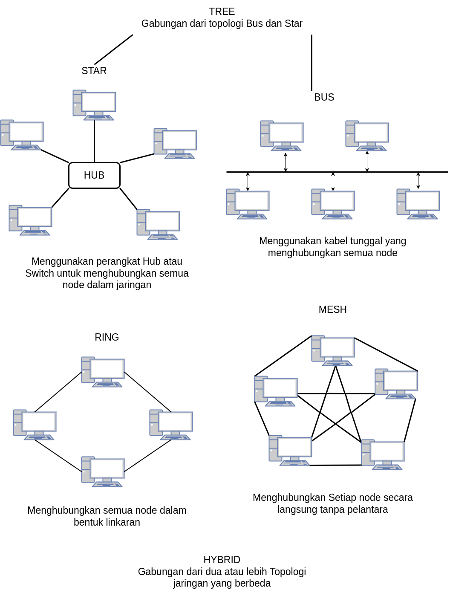

# Topologi Jaringan

 
 

1. 4 Karakteristik dasar komunikasi data adalah:
    * **Kecepatan** (speed): yaitu jumlah bit data yang dapat dikirimkan atau diterima per satuan waktu, biasanya diukur dalam bit per detik (bps).
    * **Kapasitas** (capacity): yaitu jumlah data yang dapat ditampung oleh media transmisi, biasanya diukur dalam bit atau byte.
    * **Keterandalan** (reliability): yaitu kemampuan sistem komunikasi data untuk mengirimkan dan menerima data tanpa kesalahan atau gangguan, biasanya diukur dengan tingkat error atau loss rate.
    * **Biaya** (cost): yaitu jumlah uang yang harus dikeluarkan untuk membangun, mengoperasikan, dan memelihara sistem komunikasi data, termasuk biaya perangkat keras, perangkat lunak, dan layanan.

2. 5 komponen komunikasi data adalah:
    * **Sumber data** (data source): yaitu perangkat yang menghasilkan atau menyimpan data yang akan dikirimkan, seperti komputer, kamera, sensor, dll.
    * **Transmitter** (transmitter): yaitu perangkat yang mengubah data menjadi sinyal yang sesuai dengan media transmisi, seperti modem, encoder, multiplexer, dll.
    * **Media pengiriman** (transmission medium): yaitu saluran fisik yang digunakan untuk mengirimkan sinyal dari transmitter ke receiver, seperti kabel, gelombang radio, gelombang cahaya, dll.
    * **Receiver** (receiver): yaitu perangkat yang menerima sinyal dari media pengiriman dan mengubahnya kembali menjadi data, seperti modem, decoder, demultiplexer, dll.
    * **Tujuan data** (data destination): yaitu perangkat yang menerima atau menyimpan data yang telah diterima dari receiver, seperti komputer, printer, monitor, dll.

3. Fungsi dan tujuan komunikasi data adalah:
    * **Fungsi komunikasi data** adalah untuk memungkinkan pertukaran informasi antara dua atau lebih perangkat secara efektif dan efisien melalui media transmisi tertentu.
    * **Tujuan komunikasi data** adalah untuk mencapai berbagai kepentingan atau kebutuhan dari pengguna sistem komunikasi data, seperti berbagi sumber daya, berkolaborasi, berinteraksi, belajar, berbisnis, menghibur, dll.

4. Media transmisi komunikasi data adalah:
    
        Media transmisi komunikasi data adalah saluran fisik yang digunakan untuk mengirimkan sinyal dari transmitter ke receiver dalam sistem komunikasi data. Media transmisi dapat dibedakan menjadi dua jenis utama, yaitu:

    - **Media transmisi berbasis kabel** (guided media): yaitu media transmisi yang menggunakan kabel sebagai saluran fisiknya, seperti twisted pair cable, coaxial cable, dan fiber optic cable.
    - **Media transmisi tanpa kabel** (unguided media): yaitu media transmisi yang menggunakan gelombang elektromagnetik sebagai saluran fisiknya, seperti radio wave, microwave wave, dan infrared wave.

5. Jenis transmisi komunikasi data adalah:
        
        Jenis transmisi komunikasi data adalah cara atau metode yang digunakan untuk mengirimkan sinyal dari transmitter ke receiver dalam sistem komunikasi data. Jenis transmisi dapat dibedakan menjadi dua jenis utama, yaitu:

    - **Transmisi serial** (serial transmission): yaitu jenis transmisi yang mengirimkan sinyal bit demi bit secara berurutan melalui satu saluran fisik. Transmisi serial cocok untuk jarak jauh dan media transmisi tanpa kabel.
    - **Transmisi paralel** (parallel transmission): yaitu jenis transmisi yang mengirimkan sinyal beberapa bit secara bersamaan melalui beberapa saluran fisik. Transmisi paralel cocok untuk jarak dekat dan media transmisi berbasis kabel.

6. Bentuk-bentuk komunikasi data adalah:
    
        Bentuk-bentuk komunikasi data adalah pola atau arah aliran sinyal antara dua atau lebih perangkat dalam sistem komunikasi data. Bentuk-bentuk komunikasi data dapat dibedakan menjadi tiga bentuk utama, yaitu:

    - **Komunikasi simplex** (simplex communication): yaitu bentuk komunikasi data yang hanya mengizinkan aliran sinyal satu arah dari transmitter ke receiver. Contoh komunikasi simplex adalah radio, televisi, dan keyboard.
    - **Komunikasi half-duplex** (half-duplex communication): yaitu bentuk komunikasi data yang mengizinkan aliran sinyal dua arah secara bergantian antara transmitter dan receiver. Contoh komunikasi half-duplex adalah walkie-talkie, intercom, dan telepon genggam.
    - **Komunikasi full-duplex** (full-duplex communication): yaitu bentuk komunikasi data yang mengizinkan aliran sinyal dua arah secara bersamaan antara transmitter dan receiver. Contoh komunikasi full-duplex adalah telepon kabel, internet, dan video call.

7. Protokol komunikasi data adalah:
    
        Protokol komunikasi data adalah kumpulan aturan atau kesepakatan yang mengatur proses komunikasi data antara dua atau lebih perangkat dalam sistem komunikasi data. Protokol komunikasi data menentukan berbagai aspek seperti format, ukuran, urutan, waktu, kesalahan, dan keamanan data yang dikirimkan atau diterima. Contoh protokol komunikasi data adalah TCP/IP, HTTP, FTP, SMTP, dll.

8. Jaringan komunikasi data adalah:
    
        Jaringan komunikasi data adalah sistem yang terdiri dari dua atau lebih perangkat yang saling terhubung melalui media transmisi untuk melakukan komunikasi data. Jaringan komunikasi data dapat dibedakan menjadi beberapa jenis berdasarkan cakupan geografisnya, seperti:

    - **Jaringan area lokal** (local area network): yaitu jaringan komunikasi data yang mencakup area geografis yang kecil dan terbatas, seperti ruangan, gedung, atau kampus.
    - **Jaringan area metropolitan** (metropolitan area network): yaitu jaringan komunikasi data yang mencakup area geografis yang sedang dan luas, seperti kota atau provinsi.
    - **Jaringan area luas** (wide area network): yaitu jaringan komunikasi data yang mencakup area geografis yang besar dan melintasi batas negara atau benua, seperti internet.

