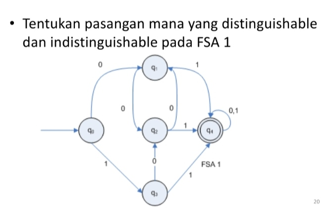

**Nama : Syukrillah** 
**NIM : 22552011247** 
**Kelas : TIF RP 222PA**

</img>
Jawaban:
- $(q_0, q_1)$  **distinguishable**

    $\delta$ $(q_0, 1) = q_3$ 
    $\delta$ $(q_1, 1) = q_4$ 
    $\delta$ $(q_0 , 0) = q_1$ 
    $\delta$ $(q_1 , 0) = q_2$

- $(q_0, q_2)$  **distinguishable**

    $\delta$ $(q_0, 1) = q_3$ 
    $\delta$ $(q_2, 1) = q_4$ 
    $\delta$ $(q_0, 0) = q_1$ 
    $\delta$ $(q_2, 0) = q_1$

- $(q_0, q_3)$  **distinguishable**
    
    $\delta$ $(q_0, 1) = q_3$ 
    $\delta$ $(q_3, 1) = q_4$ 
    $\delta$ $(q_0, 0) = q_1$ 
    $\delta$ $(q_3, 0) = q_2$

- $(q_0, q_4)$ **distinguishable**
    
    $\delta$ $(q_0, 1) = q_3$ 
    $\delta$ $(q_4, 1) = q_4$ 
    $\delta$ $(q_0, 0) = q_1$ 
    $\delta$ $(q_4, 0) = q_4$

- $(q_1, q_2)$ **indistinguishable**

    $\delta$ $(q_1, 1) = q_4$ 
    $\delta$ $(q_2, 1) = q_4$ 
    $\delta$ $(q_1, 0) = q_2$ 
    $\delta$ $(q_2, 0) = q_1$

- $(q_1, q_3)$ **indistinguishable**
    
    $\delta$ $(q_1, 1) = q_4$ 
    $\delta$ $(q_3, 1) = q_4$ 
    $\delta$ $(q_1, 0) = q_2$ 
    $\delta$ $(q_3, 0) = q_2$ 

- $(q_1, q_4)$ **distinguishable**
    
    $\delta$ $(q_1, 1) = q_4$ 
    $\delta$ $(q_4, 1) = q_4$ 
    $\delta$ $(q_1, 0) = q_2$ 
    $\delta$ $(q_4, 0) = q_4$ 

- $(q_2, q_3)$ **indistinguishable**
    
    $\delta$ $(q_2, 1) = q_4$ 
    $\delta$ $(q_3, 1) = q_4$ 
    $\delta$ $(q_2, 0) = q_1$ 
    $\delta$ $(q_3, 0) = q_2$ 

- $(q_2, q_4)$ **distinguishable**

    $\delta$ $(q_2, 1) = q_4$ 
    $\delta$ $(q_4, 1) = q_4$ 
    $\delta$ $(q_2, 0) = q_1$ 
    $\delta$ $(q_4, 0) = q_4$

- $(q_3, q_4)$  **distinguishable**

    $\delta$ $(q_3, 1) = q_4$ 
    $\delta$ $(q_4, 1) = q_4$ 
    $\delta$ $(q_3, 0) = q_2$ 
    $\delta$ $(q_4, 0) = q_4$