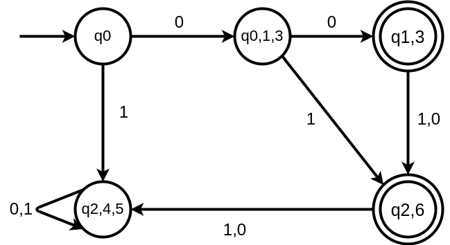

**Nama : Syukrillah** 

**NIM : 22552011247**

**Kelas : TIF RP 222PA**

1. Soal satu

   $q_0, q_1, q_3$ **indistinguishable**

   $q_0, q_1, q_3
   \begin{cases}
   (q_0, q_1) \\
   (q_0, q_3) \\
   (q_1, q_3) \\
   \end{cases}$

   $q_2, q_4, q_5$ **indistinguishable**

   $q_0, q_1, q_3
   \begin{cases}
   (q_2, q_4) \\
   (q_4, q_5) \\
   (q_2, q_5) \\
   \end{cases}$

   $$
   \delta (q_0, 0) \cup \delta (q_1, 0) \cup \delta (q_3, 0)
   $$

   $$
   \ \ \ \ \ \ q_1 \cup \ \ \ \ \ \ q_3 \cup \ \ \ \ \ \ q_3
   $$

   $ \ \ \ \ \ \ \ \ \ \ \ \ \ \ \ \ \ \ \ \ \ \ \ \ \ \ \ \ \ \ \ \ \ \ \ \ \ \ \ \ \ \ \ \ \ \ \ \ \ \ \ \ \ \ \ \ \ \ \  ${$q_1,q_3$}

   $$
   \delta (q_2, 0) \cup \delta (q_4, 0) \cup \delta (q_5, 0)
   $$

   $$
   \ \ \ \ \ \ q_4 \cup \ \ \ \ \ \ q_5 \cup \ \ \ \ \ \ q_5
   $$

   $ \ \ \ \ \ \ \ \ \ \ \ \ \ \ \ \ \ \ \ \ \ \ \ \ \ \ \ \ \ \ \ \ \ \ \ \ \ \ \ \ \ \ \ \ \ \ \ \ \ \ \ \ \ \ \ \ \ \ \  ${$q_4,q_5$}

   $$
   \delta (q_0, 1) \cup \delta (q_1, 1) \cup \delta (q_3, 1)
   $$

   $$
   \ \ \ \ \ \ q_2 \cup \ \ \ \ \ \ q_6 \cup \ \ \ \ \ \ q_6
   $$

   $ \ \ \ \ \ \ \ \ \ \ \ \ \ \ \ \ \ \ \ \ \ \ \ \ \ \ \ \ \ \ \ \ \ \ \ \ \ \ \ \ \ \ \ \ \ \ \ \ \ \ \ \ \ \ \ \ \ \ \  ${$q_2,q_6$}

   $$
   \delta (q_2, 1) \cup \delta (q_4, 1) \cup \delta (q_5, 1)
   $$

   $$
   \ \ \ \ \ \ q_4 \cup \ \ \ \ \ \ q_4 \cup \ \ \ \ \ \ q_5
   $$

   $ \ \ \ \ \ \ \ \ \ \ \ \ \ \ \ \ \ \ \ \ \ \ \ \ \ \ \ \ \ \ \ \ \ \ \ \ \ \ \ \ \ \ \ \ \ \ \ \ \ \ \ \ \ \ \ \ \ \ \  ${$q_4,q_5$}

2. Buat DFA yang ekivalen dengan NFA berikut

   $Q =$ {$q_0, q_1, q_2$}

   $\Sigma =$ {$0,1$}

   $S =$ {$q_0$}

   $F =$ {$q_1$}

   | $\delta$ | 0               | 1              |
   | ---------- | --------------- | -------------- |
   | $q_0$    | {$q_1, q_2$}  | {$q_2$}      |
   | $q_1$    | {$q_1$}       | {$q_2$}      |
   | $q_2$    | $\varnothing$ | {$q_0, q_2$} |

$$
(q_1,q_2)
$$

$$
(q_1,0)(q_2,0) \ \ \ \ \ \ \ \  (q_1,1)(q_2,1)
$$

$$
\  \ \ \ \ \ (q_1) \cup \varnothing \  \ \ \ \ \ \ \ \ \ \ (q_2) \cup (q_0,q_2)
$$

$$
(q_1) \ \ \ \ \ \ \ \ \ \ \ \ \ \ \ (q_0,q_2)
$$

$$
(q_0,q_2)
$$

$$
(q_0,0)(q_2,0) \ \ \ \ \ \ \ \  (q_0,1)(q_2,1)
$$

$$
\  \ \ \ \ \ (q_1,q_2) \cup \varnothing \  \ \ \ \ \ \ \ \ \ \ (q_2) \cup (q_0,q_2)
$$

$$
(q_1,q_2) \ \ \ \ \ \ \ \ \ \ \ \ \ \ \ (q_0,q_2)
$$

