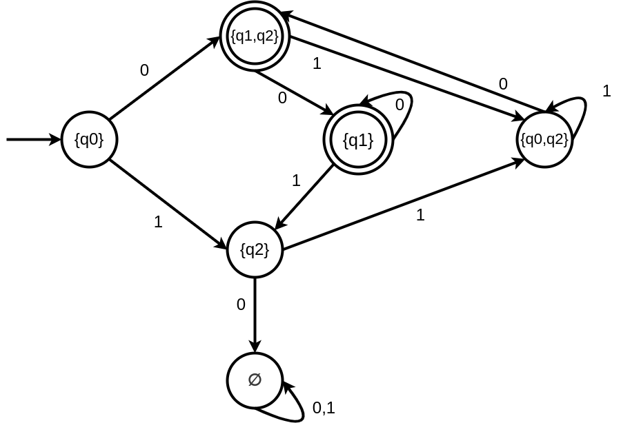

**Nama : Syukrillah**  
**NIM : 22552011247**  
**Kelas : TIF RP 222PA**

1. $(q_2, q_6)$ **indistinguishable**

   $\delta$ $(q_2, 1) = q_4$ 
   $\delta$ $(q_6, 1) = q_4$ 
   $\delta$ $(q_2, 0) = q_4$ 
   $\delta$ $(q_6, 0) = q_4$ 

   $q_2$ dan $q_6$ **dapat** di gabung menjadi satu state
2. Buat DFA yang ekivalen dengan NFA berikut

   $Q =$ {$q_0, q_1, q_2$}

   $\Sigma =$ {$0,1$}

   $S =$ {$q_0$}

   $F =$ {$q_1$}

   | $\delta$ | 0               | 1              |
   | ---------- | --------------- | -------------- |
   | $q_0$    | {$q_1, q_2$}  | {$q_2$}      |
   | $q_1$    | {$q_1$}       | {$q_2$}      |
   | $q_2$    | $\varnothing$ | {$q_0, q_2$} |

$$(q_1,q_2)$$
$$(q_1,0)(q_2,0) \ \ \ \ \ \ \ \  (q_1,1)(q_2,1)$$
$$ \  \ \ \ \ \ (q_1) \cup \varnothing \  \ \ \ \ \ \ \ \ \ \ (q_2) \cup (q_0,q_2)$$
$$(q_1) \ \ \ \ \ \ \ \ \ \ \ \ \ \ \ (q_0,q_2)$$

$$(q_0,q_2)$$
$$(q_0,0)(q_2,0) \ \ \ \ \ \ \ \  (q_0,1)(q_2,1)$$
$$ \  \ \ \ \ \ (q_1,q_2) \cup \varnothing \  \ \ \ \ \ \ \ \ \ \ (q_2) \cup (q_0,q_2)$$
$$(q_1,q_2) \ \ \ \ \ \ \ \ \ \ \ \ \ \ \ (q_0,q_2)$$
 

</img>